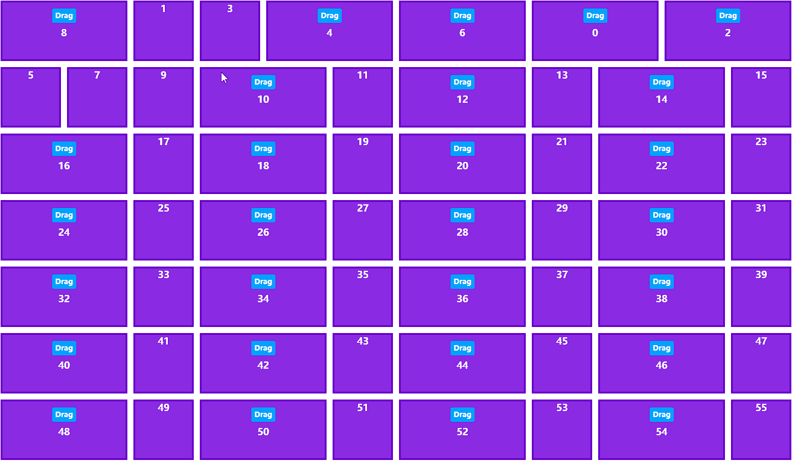

# React-Draggable-Masonry

An open source library to provider a draggable masonry layout for your react projects, the layout is implmented by CSS and the lib is lightweight, only dependent on react.

# Demo



# Install

```shell
npm install --save react-draggable-masonry
```

# Usage

```javascript
import { ContainerWrapper, DragButton, ItemWrapper } from "react-draggable-masonry";

const size = 100;
const tilesTotal = 100;

export default function App() {
  return (
    <ContainerWrapper gap={10} columnWidth={size} rowHeight={size}>
      {new Array(tilesTotal).fill("test").map((item, i) =>
        i % 2 === 0 ? (
          <ItemWrapper key={i} tileId={i}>
            <DragButton>Drag</DragButton> {/* put a drag button to enable drag function */}
            {i}
          </ItemWrapper>
        ) : (
          <div key={i}>{i}</div> /* fixed items, these item will not able to interact with your mouse. */
        )
      )}
    </ContainerWrapper>
  );
}
```

you may need style to make masonry visiable, check the App.tsx in github

# API

## ContainerWrapper

Inherit all props from HTMLDIVElement and also have following props additional:
| Prop | Type | Description
|:----: |:----: |------------
|gap |number | the gap between grid tiles
|columnWidth |number | grid tile's width
|rowHeight |number | grid tile's height
|onOrderChange|function | event handler for tile's order change: (order: Array<number \| string>) => void

it can be add a ref props and the ref give you access for original tiles and boxes:

```typescript
{
  switchOrder: (origin: TileId, target: TileId) => void;
  setOrder: (order: Array<TileId>) => void;
  tiles: { [key: string]: Tile };
  boxes: { [key: string]: HTMLDivElement };
}
```

### ItemWrapper

It provide default style and function for tile to make it adapt for flex grid (but a tile also can be put into container with out ItemWrapper, it will treat as a fixed item)
| Prop | Type | Description
|:----: |:----: |------------
|tileId |number or string | mandatory field
|colSpan |number | occupied columns for tile
|rowSpan |number | occupied rows for tile

### DragButton

Provide drag & drop function to a wrapped tile
